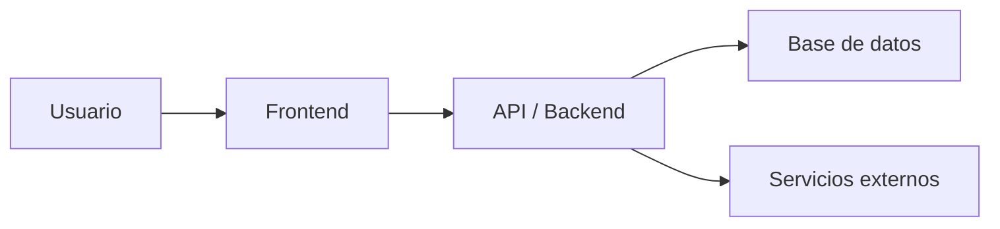

# Cómo se compone una aplicación web

Esta guía explica, de forma simple, **cómo se compone una aplicación web** y cómo se conectan sus partes.

La idea no es aprender a programar, sino tener una **idea básica** para entender mejor qué estamos cambiando cuando trabajamos con Lovable, dónde puede estar un problema y qué impacto puede tener una decisión.

---

## Idea rápida

Una aplicación web normalmente tiene estas piezas:

- **Frontend:** lo que ve y usa el usuario.
- **Backend:** la lógica que procesa reglas y acciones.
- **Base de datos:** donde se guarda la información.
- **API:** la forma en que las partes se comunican con otras.

En palabras simples:

El usuario interactúa con una pantalla, esa pantalla puede pedir o enviar información, el sistema la procesa y luego la guarda o la devuelve.

---

## Glosario

- **Aplicación web:** Software que se usa desde el navegador.
- **Frontend:** Parte visual e interactiva de la aplicación.
- **Backend:** Parte que procesa lógica, validaciones y operaciones internas.
- **Base de datos:** Lugar donde se almacena la información.
- **API:** Medio por el que una parte del sistema le pide algo a otra.
- **Edge Function:** Función del backend que corre del lado del servidor para ejecutar lógica específica.
- **Entorno:** Versión separada del proyecto, por ejemplo **Test** o **Prod**.

---

## Las piezas principales

### Frontend

Es la parte que el usuario ve y con la que interactua:

- Pantallas
- Botones
- Formularios
- Tablas
- Mensajes
- Validaciones visuales

Ejemplos:

- Una pantalla de login
- Un formulario para crear un registro
- Una tabla con una lista de pedidos

---

### Backend

Es la parte que resuelve lógica del sistema.

Por ejemplo:

- Validar si un usuario tiene permiso
- Calcular un monto
- Decidir qué datos se pueden modificar
- Procesar una acción más compleja
- Conectarse con otros servicios

El usuario normalmente **no ve NI interactúa directamente con** el backend, pero muchas acciones importantes dependen de él.

---

### Base de datos

Es donde vive la información del sistema.

Por ejemplo:

- Usuarios
- Pedidos
- Tareas
- Pagos
- Configuraciones

La base de datos no es “la pantalla”; es el lugar donde se guardan los datos que luego aparecen en la pantalla.

---

### API

Una API es el **puente de comunicación** entre partes del sistema.

Por ejemplo:

- El frontend le pide al backend la lista de pedidos
- Una edge function guarda información en la base de datos
- El sistema consulta un servicio externo

No hace falta pensarla como algo complicado.  
En la práctica, una API es simplemente una forma ordenada de **pedir datos o ejecutar acciones**.

#### Analogía simple

Una forma fácil de entenderlo es pensar en un restaurante:

- El **frontend** es lo que el cliente ve y usa, como el plato que recibe en la mesa
- El **backend** es la cocina o el chef, donde realmente se prepara la orden
- La **API** sería el mesero, que lleva la petición del cliente a la cocina y luego trae de vuelta el resultado

El cliente no entra directamente a la cocina ni prepara la comida por su cuenta.  
Hace una petición, esa petición viaja por el mesero, la cocina la procesa y luego llega la respuesta.

Con una aplicación pasa algo parecido:

- El usuario hace una acción en frontend
- Esa acción viaja por una API
- El backend procesa la solicitud
- Finalmente se devuelve una respuesta para mostrarla en pantalla

---

## Cómo se conectan estas piezas

Una forma simple de verlo es así:

Ejemplo:

1. El usuario llena un formulario.
2. El frontend envía esa información.
3. El backend o una edge function valida la acción.
4. Si todo está bien, se guarda en la base de datos.
5. El sistema responde.
6. El frontend muestra el resultado al usuario.

---

## Ejemplo simple

Supongamos que un usuario crea una tarea en una app.

### Lo que ve el usuario

Ve un formulario con campos como:

- Título
- Descripción
- Fecha

Eso es **frontend**.

### Lo que pasa al guardar

Cuando presiona “Guardar”, el sistema puede:

- Revisar si el usuario tiene permiso
- Asignar datos automáticos
- Guardar la tarea

Eso ya involucra **backend** y **base de datos**.

### Cómo viaja la información

Ese envío normalmente ocurre a través de una **API**.

---

## Cómo se ve esto en Landscapes

En Landscapes, este mapa suele verse así:

- **Lovable** nos ayuda a construir y modificar la aplicación.
- El **frontend** es la parte visual del proyecto.
- **Supabase** nos ayuda con base de datos y otros servicios.
- Las **Edge Functions** se usan cuando hace falta lógica de servidor.

Entonces, aunque alguien no programe de forma tradicional, igual puede terminar tocando partes distintas del sistema:

- Una pantalla,
- Una tabla de base de datos,
- Una edge function,
- Una integración,

Por eso es importante entender este mapa general.

---

## Qué cosas suelen confundirse

### “Si cambia la pantalla, solo cambió el frontend”

No siempre, a veces un cambio visual también requiere:

- Guardar nuevos datos
- Cambiar reglas
- Modificar permisos
- Actualizar una edge function
- Cambiar la base de datos

---

### “La base de datos es lo mismo que la app”

No, la app es la experiencia que usa el usuario mientras que la base de datos es donde se guarda la información que esa app usa.

---

## Cómo pensar un problema usando este mapa

Cuando algo falla, ayuda hacerse estas preguntas:

- ¿El problema está en lo que se ve en pantalla?
- ¿El dato no se está guardando?
- ¿La acción depende de permisos o validaciones?
- ¿La información existe en la base de datos pero no aparece?
- ¿La app está fallando al comunicarse con otra parte del sistema?

No hace falta saber programar para pensar así.  
Solo necesitas ubicar **en qué parte del flujo podría estar el problema**.

---

## Ideas clave para recordar

- Una aplicación web no es solo una pantalla.
- El frontend muestra y captura acciones del usuario.
- El backend procesa lógica y reglas.
- La base de datos guarda información.
- La API conecta unas partes con otras.
- Un mismo cambio puede tocar varias capas al mismo tiempo.
