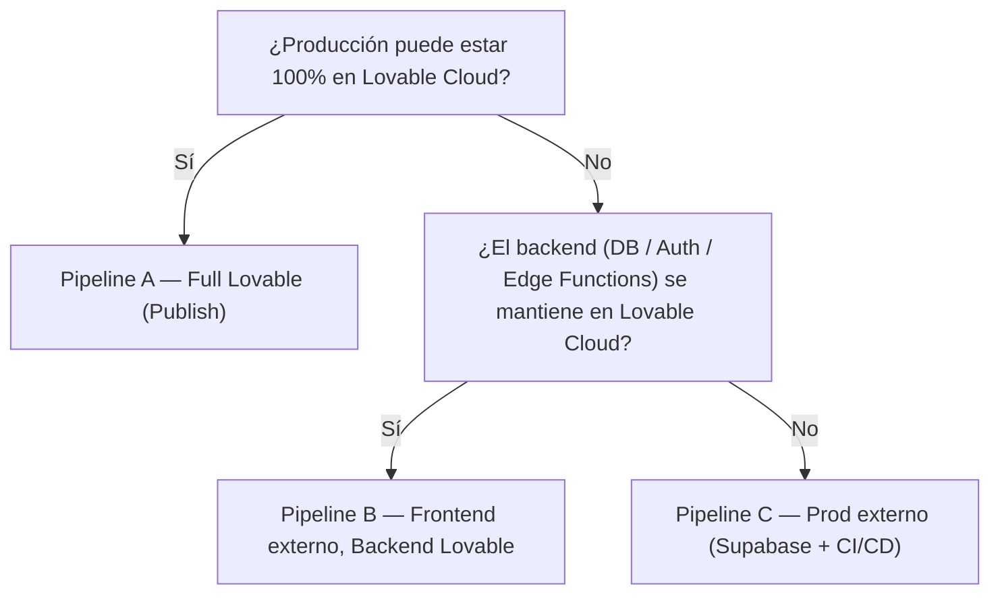

Esta sección documenta **cómo desplegamos cambios** cuando trabajamos con Lovable. Existen **tres pipelines** porque no todos los proyectos tienen las mismas restricciones de hosting, control operativo o compliance.

## ¿Qué pipeline debo usar?

### Pipeline A — Full Lovable (Publish)

Úsalo cuando:

- El **frontend** y el **backend** (DB/Auth/Edge Functions) viven dentro de **Lovable Cloud**.
- Queremos el flujo más simple: **release = Publish**.
- No necesitamos CI/CD externo ni un hosting obligatorio fuera de Lovable.

**[Pipeline A — Full Lovable (Publish)](/docs/lovable-ops/full-lovable)**.

### Pipeline B — Frontend externo, Backend en Lovable (Publish + hosting externo)

Úsalo cuando:

- El **frontend** debe hostearse fuera (Vercel/Netlify/Cloudflare/etc.).
- El **backend** (DB/Auth/Edge Functions) se mantiene en **Lovable Cloud**.
- El release del backend sigue siendo **Publish**, pero el deploy del frontend se gestiona en el hosting externo.

**[Pipeline B — Frontend externo, Backend Lovable](/docs/lovable-ops/external-frontend-lovable-backend)**.

### Pipeline C — Producción fuera de Lovable (Supabase externo + CI/CD)

Úsalo cuando:

- **Producción** (backend) debe vivir fuera de Lovable, normalmente en **Supabase externo**.
- Necesitamos CI/CD para desplegar:
  - **migraciones** (schema)
  - **edge functions**
  - y/o configuración por ambiente
- Lovable se usa principalmente para iterar rápido en desarrollo, pero el **deploy real** lo controla el pipeline externo.

**[Pipeline C — Prod externo (Supabase + CI/CD)](/docs/lovable-ops/external-prod-supabase-cicd)**.

---

## Árbol de decisión

