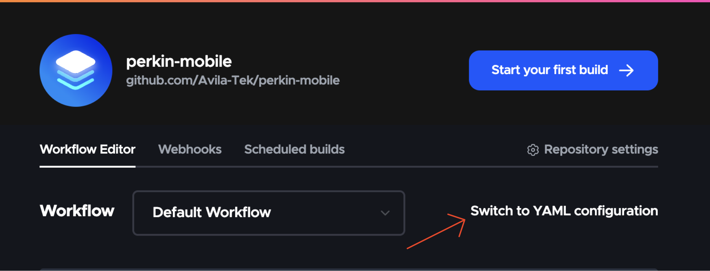
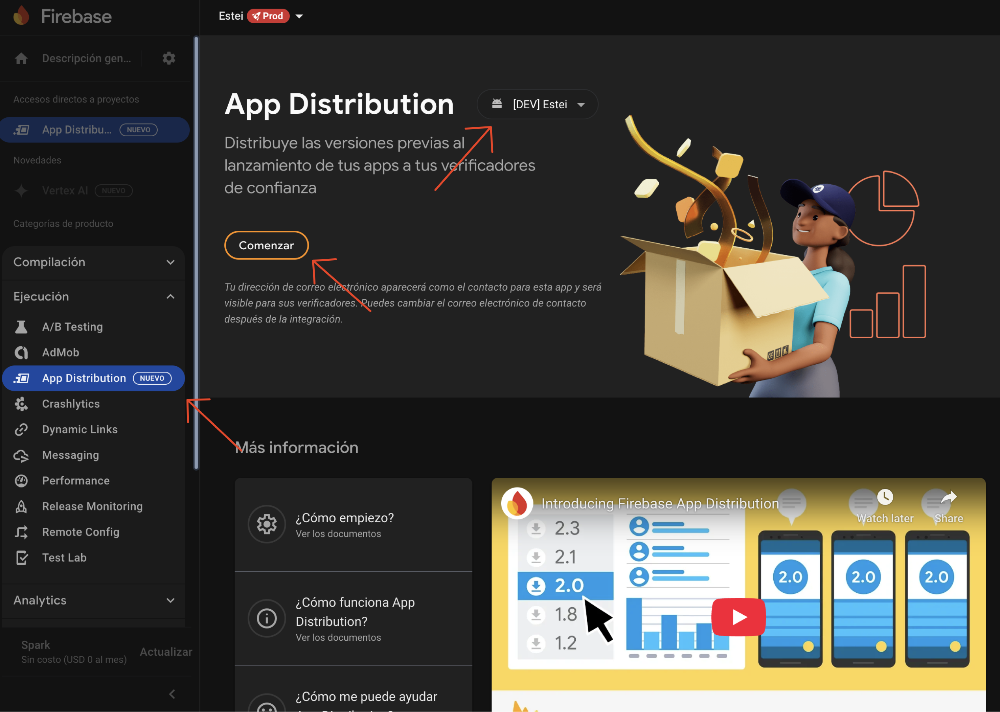
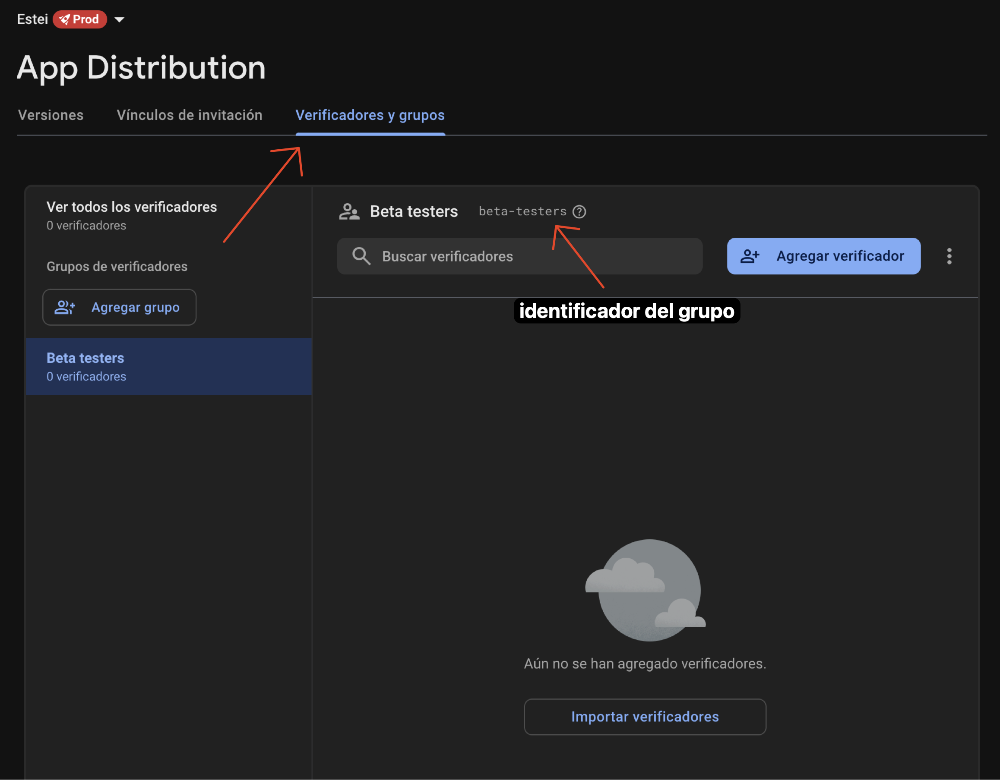
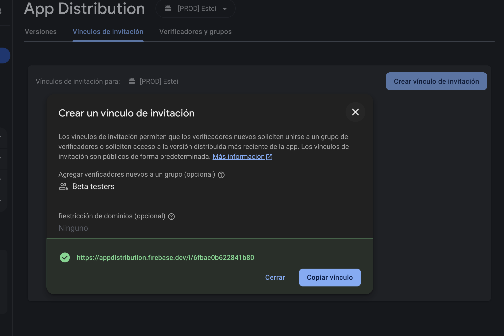
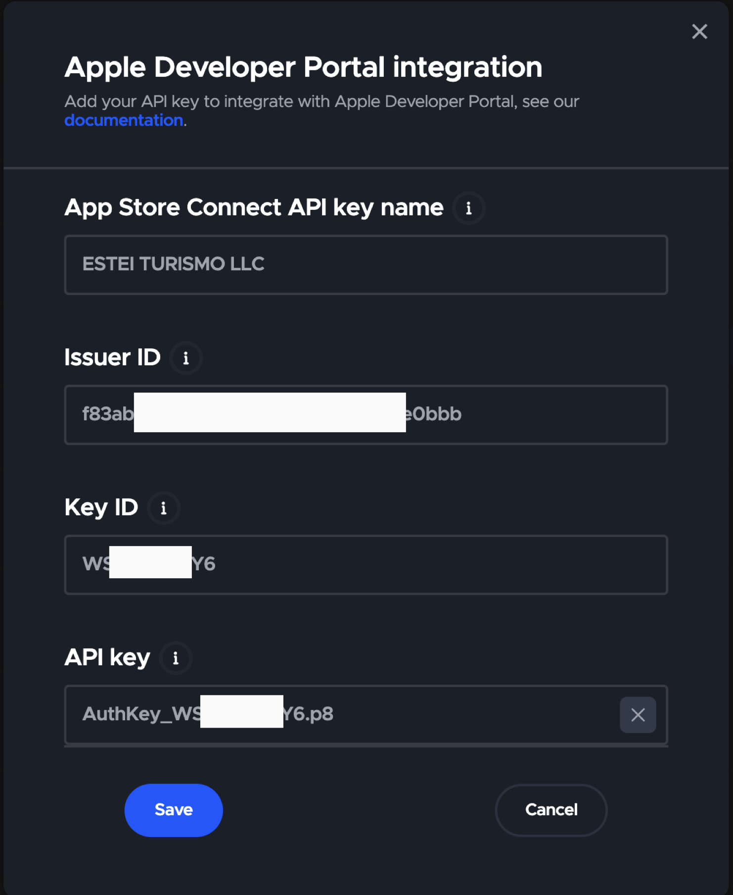
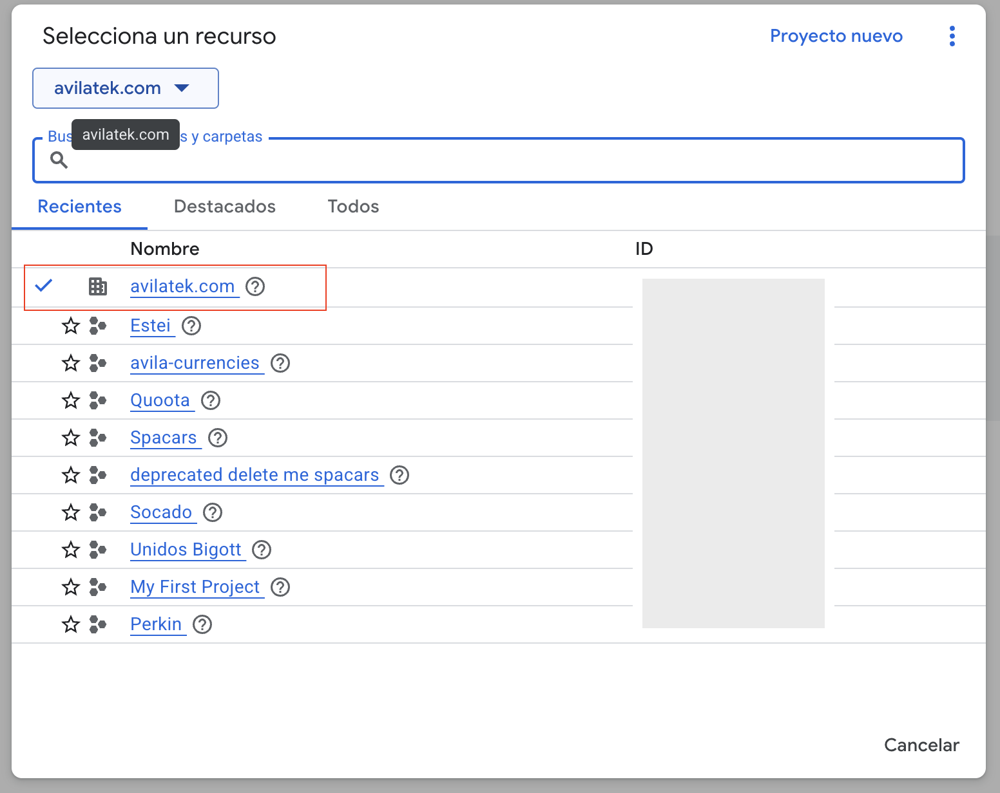

# Configuración de Codemagic para Flutter

¡Bienvenido a la guía de configuración de Codemagic para Flutter! En esta guía, aprenderás todo lo que necesitas saber para configurar un proyecto Flutter de Avila Tek en Codemagic, una plataforma de integración y entrega continua (CI/CD). Esta guía te llevará a través de los pasos necesarios para configurar tu proyecto y comenzar a usar Codemagic para compilar y desplegar tu aplicación Flutter.

Al finalizar esta guía, habrás aprendido a:
- Crear un nuevo proyecto en la plataforma de Codemagic.
- Configurar el flujo de trabajo de compilación y despliegue con archivo YAML.
- Configurar las variables de entorno en Codemagic.
- Integrar el despliegue con **Firebase App Distribution**.
- Configurar el despliegue en **TestFlight**.
- Configurar el despliegue en **Google Play**.
- Configurar el despliegue en **App Store**.

Dicho esto, ¡comencemos 🚀!

<!--Insertar meme chistoso :)-->

## Requisitos previos

Antes de comenzar, asegúrate de tener lo siguiente:
- Acceso a la cuenta de Codemagic de Avila Tek.
- Un proyecto de Flutter alojado en un repositorio de Github y asociado a un proyecto de Firebase.
- Acceso a las cuentas de Firebase, TestFlight, Google Play Store y App Store Connect.
  
## Configuración de Codemagic

### Crear un nuevo proyecto

1. Inicia sesión en la cuenta de Codemagic. Una vez dentro, dirigete a la sección de [Aplicaciones](https://codemagic.io/apps) y pulsa el botón **Add application**.

2. Selecciona GitHub (el proveedor del repositorio donde está alojado tu proyecto).

3. Selecciona el repositorio de tu proyecto Flutter. Luego, en el tipo de proyecto selecciona **Flutter**. 

> Si tienes problemas para encontrar tu repositorio, asegúrate de que tu cuenta de GitHub esté conectada a Codemagic y tenga acceso al repositorio específico.

En este punto habrás creado un nuevo proyecto en Codemagic en modo Workflow Editor (editor del flujo de trabajo por web). Sin embargo, nosotros utilizaremos la configuración con YAML. Pulsa la opción **Switch to YAML** bajo la barra de opciones en el detalle de la aplicación creada, elige la opción "codemagic.yaml" y guarda los cambios.



Una vez que hayas cambiado a la configuración YAML, verás el archivo de configuración `codemagic.yaml` de tu proyecto si ya existe. Si no existe, debes crear uno en la raiz de tu proyecto. 

> Nota: Se recomienda fuertemente crear el archivo codemagic.yaml con el brick [`avila_codemagic`](https://brickhub.dev/bricks/avila_codemagic/0.1.0) del equipo.

### Configuración del archivo YAML
El archivo `codemagic.yaml` es el corazón de la configuración de tu proyecto en Codemagic. Aquí es donde definirás cómo se construye y despliega tu aplicación. A continuación, te mostramos un ejemplo básico de un archivo `codemagic.yaml` para un proyecto Flutter:

```yaml
workflows:
  foo-workflow-identifier: # <- Identificador único del flujo de trabajo
    name: "[STG] iOS & Android deploy" # <- Nombre del flujo de trabajo
    environment:
      flutter: 3.29.0 # <- Versión de Flutter
      # xcode: latest # <- (Opcional) Versión de Xcode, normalmente no es necesario especificar.
       android_signing:
        - avilatek_upload_ks # <- Identificador de la keystore de Android de la app (luego veremos esto).
      ios_signing:
        distribution_type: app_store
        bundle_identifier: com.avilatek.example.stg # <- Identificador del bundle de la app
      groups: # <- Grupos de variables de entorno (más información en la sección de Variables de entorno)
        - play_store_credentials
        - firebase_credentials
        - staging
        - all
    
    # Directorios a cachear entre compilaciones. Esto ayuda a acelerar el proceso de compilación al evitar la descarga de dependencias cada vez que realizas una nueva compilación.
    cache: 
      cache_paths:
        - $HOME/.gradle/caches
        - $FLUTTER_ROOT/.pub-cache
        - $HOME/Library/Caches/CocoaPods

    triggering:
      # ... # <- Configuración de triggers que ejecutan el flujo de trabajo automáticamente al hacer push a una rama específica.

    scripts: # <- Scripts a ejecutar antes, durante y despues de la compilación de la app.
      # ... 
    artifacts: # <- Lista de rutas a los artefactos de la app (compilables, .aab, .apk, .ipa, etc.)
      # ... 

    integrations:
      app_store_connect: Avila Tek CA # <- Nombre de la integración de App Store Connect (ver sección de Integraciones)

    publishing:
      app_store_connect: # <- Configuración de la publicación en App Store y TestFlight
        # ...
      firebase: # <- Configuración de la publicación en Firebase App Distribution (generalmente solo Android en el canal beta)
       # ...
      google_play: # <- Configuración de la publicación en Google Play Store
        # ...
      email:
        recipients: # <- Lista de correos electrónicos a los que se enviará el correo de notificación al finalizar la compilación.
```

> Puedes consultar la [documentación oficial de Codemagic](https://docs.codemagic.io/yaml-basic-configuration/yaml-getting-started/) para obtener más información sobre la configuración del archivo YAML y las opciones disponibles.

La mayoría de las opciones de configuración las genera el brick `avila_codemagic`, a excepción de las variables de entorno en el bloque scripts, especificamente el script de configuración de variables de entorno. Esto debes hacerlo para cada uno de los workflows del archivo (más información en la sección de [variables de entorno](#configuración-de-variables-de-entorno-de-codemagic)).

Generalmente, solo es necesario que configures el ambiente de staging (o QA) y producción. Si tienes un ambiente de desarrollo, puedes configurarlo como un workflow adicional.

### Configuración de variables de entorno de Codemagic

Las variables de entorno son una parte importante de la configuración de tu proyecto en Codemagic. Estas variables se utilizan para almacenar información sensible, como claves API, credenciales y otros datos que no deseas incluir directamente en tu código fuente.

Codemagic permite configurar variables de entorno directamente desde la plataforma para evitar exponer información sensible en el archivo `codemagic.yaml`. Para configurar las variables de entorno, ve a la pestaña **Environment variables** en la configuración de tu aplicación en Codemagic. Aquí puedes agregar, editar y eliminar variables de entorno según sea necesario.

Debes crear las variables con el mismo nombre que como las configuraste en el proyecto de Flutter. 

En el grupo de la variable de entorno debes seleccionar la apropiada según la variable de entorno. Para la fecha, manejamos los siguientes grupos de variables:
- `staging`: Variables de entorno para el ambiente de staging.
- `production`: Variables de entorno para el ambiente de producción.
- `firebase_credentials`: Variables de entorno para la configuración de Firebase. Probablemente solo la uses para configurar la cuenta de servicio de Firebase.
- `play_store_credentials`: Variables de entorno para la configuración de Google Play Store. Probablemente solo la uses para configurar la cuenta de servicio de Google Play Store.
- `all`: Variables de entorno que se aplican a todos los ambientes por igual.

Estos grupos solo son una referencia, puedes crear los grupos que necesites según la organización de tu proyecto y prescindir de los que no necesites. Sin embargo, el brick `avila_codemagic` utiliza estos grupos para organizar las variables de entorno y facilitar su configuración, así que se recomienda seguir esta convención.

Estos grupos son importantes en la configuración del flujo de trabajo en el `codemagic.yaml`. Cada workflow define los grupos de variables de ambiente a los que tendrá acceso durante la ejecución en la sección `groups`. Más información [aquí](https://docs.codemagic.io/yaml-basic-configuration/yaml-getting-started/#environment).

Finalmente, puedes marcar la casilla **Secure** para ocultar el valor de la variable. Esto es esencialmente necesario para las variables de ambiente sensibles como llaves de APIs o crendenciales de cuentas de servicio. Para variables no sensibles como el host del servidor (API URLs), el ID de Firebase, etc., no es necesario marcar la casilla **Secure**. Esto te permitirá actualizar con mayor facilidad el valor de la variable en un futuro.

> Nota: Las variables creadas de forma segura no pueden ser accedidas una vez las creas. Recuerda guardar de forma segura la credencial si luego necesitas acceder a ella.

#### Variables de entorno para Firebase y Google Play

Para configurar las variables de entorno para Firebase, debes crear las siguientes variables en el grupo `firebase_credentials`:

- `{ENV}_FIREBASE_APPLICATION_ID`: El ID del proyecto de Firebase. Cambia `{ENV}` por el ambiente correspondiente (`STG` para staging o `PROD` production). Por ejemplo `STG_FIREBASE_APPLICATION_ID`. No es necesario crearla como una variable segura.
- `FIREBASE_SERVICE_ACCOUNT_CREDENTIALS`: La cuenta de servicio de Firebase en formato JSON. Puedes obtenerla desde la consola de Firebase de tu proyecto. Más información en la sección de integración con [Firebase App Distribution](#integración-con-firebase-app-distribution). Es obligatorio crearla como una variable segura.

Para configurar las variables de entorno para Google Play Store, debes crear las siguientes variables en el grupo `play_store_credentials`:

- `GCLOUD_SERVICE_ACCOUNT_CREDENTIALS`: La cuenta de servicio de Google Play Store en formato JSON. Puedes obtenerla desde la consola de Google Play Store de tu proyecto. Más información en la sección de integración con [Google Play](#integración-con-google-play). Es obligatorio crearla como una variable segura.


### Integración con Firebase App Distribution

Firebase App Distribution es una herramienta que permite distribuir versiones beta de tu aplicación a testers y usuarios internos. En Avila Tek usamos Firebase App Distribution para desplegar las versiones de Android de nuestras apps a los testers internos. 

#### Crear la cuenta de servicio de Firebase

Sigue la [documentación oficial](https://docs.codemagic.io/yaml-publishing/firebase-app-distribution/) para crear una llave de cuenta de servicio de Firebase. Puedes ignorar el resto de la guía por ahora.

Una vez tengas el archivo JSON de la cuenta de servicio, copia el contenido y pégalo en la variable de entorno `FIREBASE_SERVICE_ACCOUNT_CREDENTIALS` que creaste anteriormente (en la documentación de Codemagic le dan un nombre diferente a la variable, puedes ignorarlo). Asegúrate de marcar la casilla **Secure** para ocultar el valor de la variable.


#### Inicializar App Distribution en el proyecto

Una vez configurada la variable de ambiente con la cuenta de servicio de Firebase, solo nos queda inicializar Firebase App Distribution. Para ello, dirigete nuevamente al proyecto en la consola de Firebase y ve a la sección de **App Distribution**. Selecciona la app que deseas configurar y ve a la pestaña de **Testers**. Aquí podrás agregar los testers que desees. Puedes agregar testers individuales o grupos de testers.

Selecciona la aplicación que deseas configurar (en este caso la de Android) y dale al botón **Comenzar** (Get started). 



Finalmente, solo queda agregar el grupo de testing para facilitar la distribución a través de un link. Ve a la pestaña **Verificadores y grupos** y haz clic en agregar un grupo de testers. Coloca un nombre para el grupo y guarda los cambios. Copia el identificador del grupo y actualiza tu archivo codemagic.yaml en el bloque de `publishing` de la siguiente manera:

```yaml
publishing:
  firebase:
    android:
      groups: 
        - beta-testers # <- Identificador del grupo de testers creado en la consola de Firebase
```



#### Crear un vínculo de distribución

Para generar un link de distribución de la app para que los usuarios puedan descargarla, ve a la pestaña **Vínculos de invitación** y haz clic en **Crear un vínculo de invitación**. Selecciona el grupo de testers que creaste anteriormente y haz clic en **Crear vínculo**. Copia el link y distribuyelo a los testers. Este link les permitirá descargar la app directamente desde Firebase App Distribution.



## Integración con App Store y TestFlight

Para poder publicar en App Store y TestFlight, es necesario tener una cuenta de Apple Developer integrada en Codemagic. Si la aplicación será publicada en la cuenta de Avila Tek, la integración ya está configurada. En el caso de publicar en una cuenta diferente dirigete a la sección de [Integración de cuenta de Apple Developer en Codemagic](#integración-de-cuenta-de-apple-developer-en-codemagic-opcional) para más información.

### Integración de cuenta de Apple Developer en Codemagic (opcional)

En caso de que la app deba subirse en una cuenta distinta a la de Avila Tek, es necesario integrar la cuenta de Apple Developer del cliente en Codemagic. Para ello, necesitas hacer dos cosas:

#### 1. Generar una llave API de App Store Connect.

El primer paso debe realizarse iniciando sesión en App Store Connect desde la cuenta owner de la organización de Apple. Si no tienes acceso a la cuenta owner, debes pedirle al cliente que lo haga por ti. Para ello deben seguir los pasos indicados [aquí](https://docs.codemagic.io/yaml-publishing/app-store-connect/), especificamente la sección **Creating the App Store Connect API key**. Necesitarás la **llave API** junto con el **Issuer ID** y el **Key ID** para el siguiente paso.

#### 2. Subir la llave API a Codemagic.

Una vez tengas la llave API, en Codemagic ve a la sección de **Teams**, selecciona el equipo y abre la opción **Integrations**. En la opción **Developer Portal** dale a **Manage keys** > **Add another key** y llena los campos con la información generada en el paso previo. El primer campo, **App Store Connect API key name**, es un identificador que usaras luego en el archivo codemagic.yaml para indicar cual llave usar en el proceso de despliegue, así que asegúrate de que sea único y fácil de recordar. Por ejemplo, puedes usar el nombre del cliente o el nombre del proyecto.




#### 3. Actualiza la configuración de codemagic.yaml.

Por último, debes actualizar el archivo `codemagic.yaml` para incluir la integración de App Store Connect. En la sección de `integrations.app_store_connect`, debes incluir el identificador de la llave que creaste en el paso anterior. Por ejemplo:

```yaml
    integrations:
      app_store_connect: ESTEI TURISMO LLC # <- Nombre de la integración de App Store Connect (ver sección de Integraciones)
```

> Más información en la [documentación oficial](https://docs.codemagic.io/yaml-publishing/app-store-connect/#setting-up-publishing-to-app-store-connect).


### Subir a TestFlight

Una vez configurado el archivo `codemagic.yaml` con la integración de App Store Connect, puedes proceder a subir la app a TestFlight. Para ello, asegurate de actualizar el bloque `publishing.app_store_connect` con la configuración requerida, especialmente los grupos de testers. Más detalles [aquí](https://docs.codemagic.io/yaml-publishing/app-store-connect/#setting-up-publishing-to-app-store-connect).

Asegurate de crear la aplicación en App Store Connect antes de intentar subirla. Puedes hacerlo desde la sección de **Mis Apps** en el perfil de la organización en App Store Connect.

La primera vez que subas la app a TestFlight, es normal que el build falle la etapa de *publishing* o *post-processing* de Codemagic debido a que no existen los grupos de testers especificados en el `codemagic.yaml`. Sin embargo, la versión se subirá a TestFlight sin grupos asociados.

Una vez subida la app, dirígete a la sección de **TestFlight** en App Store Connect y agrega los testers a los grupos correspondientes. Luego, puedes enviar la app a revisión para que sea publicada en la App Store. Asegurate de darle los mismos nombres a los grupos de testers que usaste en el `codemagic.yaml` para que Codemagic pueda asociarlos correctamente en el próximo deploy.

#### Grupos internos vs. externos

En TestFlight, puedes crear grupos de testers internos y externos. Los testers internos son aquellos que tienen acceso a la cuenta de Apple Developer y pueden probar la app antes de que sea publicada. Los testers externos son aquellos que no forman parte de la organización de la cuenta de Apple Developer–normalmente este es el grupo donde incluímos a los clientes quieres no forman parte de la organización. Para poder crear un grupo externo debe haber al menos una versión publicada en TestFlight. Si ya publicaste tu primera versión, deberías tener la opción para crear tanto grupos internos como externos.

Los grupos internos pueden probar la app sin necesidad de aprobación, mientras que los grupos externos deben esperar a que la app sea aprobada por Apple antes de poder probarla. Esto es importante tenerlo en cuenta al momento de crear los grupos de testers en App Store Connect.

> Aclaración: Esta aprobación no es la misma que la revisión de la app para ser publicada en la App Store. La aprobación de TestFlight es un proceso separado que permite a los testers externos probar la app antes de que sea publicada en la App Store. Esta aprobación en TestFlight es mucho menos restrictiva que la revisión de App Store y permite versiones incompletas de la misma.

### Subir a App Store

Una vez que hayas subido la app a TestFlight y hayas agregado los testers a los grupos correspondientes, puedes proceder a subir la app a la App Store. Para ello, asegúrate de actualizar el bloque `publishing.app_store_connect` con la configuración requerida. Más detalles [aquí](https://docs.codemagic.io/yaml-publishing/app-store-connect/#setting-up-publishing-to-app-store-connect).

Puedes configurar cosas como que la app sea enviada automáticamente a revisión, que se libere automáticamente una vez aprobada, etc. Te recomiendo que seas cuidadoso con estas opciones para evitar subir una versión a tiendas por error.

### Integración con Google Play

Para integrar Google Play en Codemagic, el proceso es similar al de Firebase App Distribution. Primero necesitamos una cuenta de servicio de Google Cloud Platform asociada a la cuenta de la organización de Google Play. 

Si la app será publicada en la cuenta de Avila Tek, ya existe una cuenta de servicio y solo requieres la llave de la cuenta de servicio. Debes solicitarle al Gerente o el Coordinador del departamento que configuren la variable de ambiente con la llave de la cuenta de servicio del equipo. 

Si la app será publicada en una cuenta diferente, debes primero crear una cuenta de servicio en la consola de Google Cloud Platform (GCP) a nivel de la organización.



Si no tienes acceso a la cuenta de GCP de la organización, debes pedirle al cliente que te invite, preferiblemente con permisos de administración, o que realice el siguiente paso por ti.

> Aclaración: La consola de GCP **a nivel de organización** es distinto a la consola de GCP a nivel de proyecto. La cuenta de servicio debe ser creada a nivel de organización para que funcione el despliegue a Google Play.


Para crear la cuenta de servicio y agregarlo a Google Play, puedes seguir los pasos indicados [aquí](https://docs.codemagic.io/yaml-publishing/google-play/). Asegurate de darle permisos de **Service Account User** (Usuario de cuenta de servicio) o similar.

> Nota: Este paso incluye tanto la creación de la cuenta de servicio como la creación de la llave de la cuenta de servicio y la invitación a Google Play de dicha cuenta de servicio. Debes tener acceso tanto a GCP como al equipo de Google Play.

Una vez hayas seguido los pasos indicados en la documentación, debes copiar el contenido de la llave de la cuenta de servicio generada y pegarlo en la variable de entorno `GCLOUD_SERVICE_ACCOUNT_CREDENTIALS` que creaste anteriormente. Asegúrate de marcar la casilla **Secure** para ocultar el valor de la variable. Recomiendo adicionalmente que guardes la llave de la cuenta de servicio en el vault de secretos del departamento para evitar que se pierda.

> Nota: En caso de perder la llave, puedes generar una nueva para la misma cuenta de servicio. ¡Asegurate de actualizar la variable de ambiente de Codemagic en caso necesario!